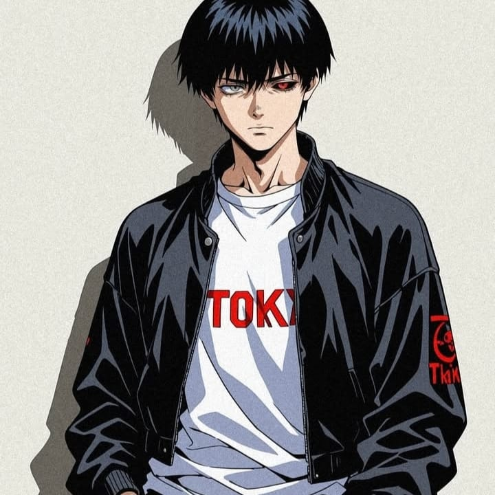

  

###

<h1 align="center">HI! I'm Fahri Husain,I'm fullstackdeveloper</h1>

###

  
  
  
  

###

  
  
  
  
  
  
  
  
  
  
  
  
  
  
  
  
  
  
  

###

<picture>
  <source media="(prefers-color-scheme: dark)" srcset="https://raw.githubusercontent.com/fahrihusain/fahrihusain/output/github-contribution-grid-snake-dark.svg">
  
</picture>

###
